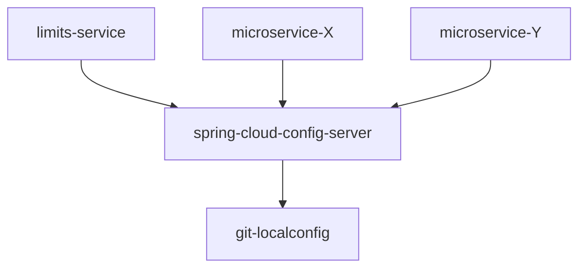
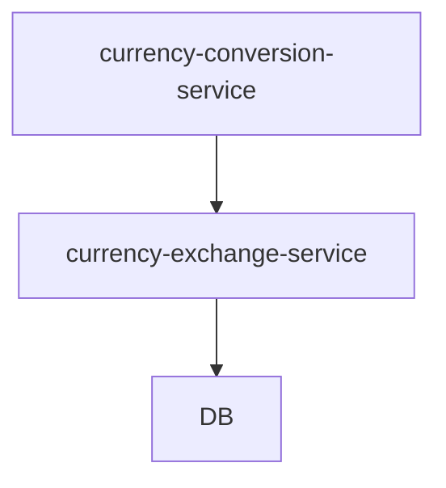
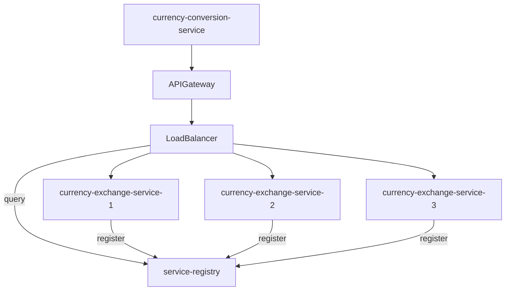
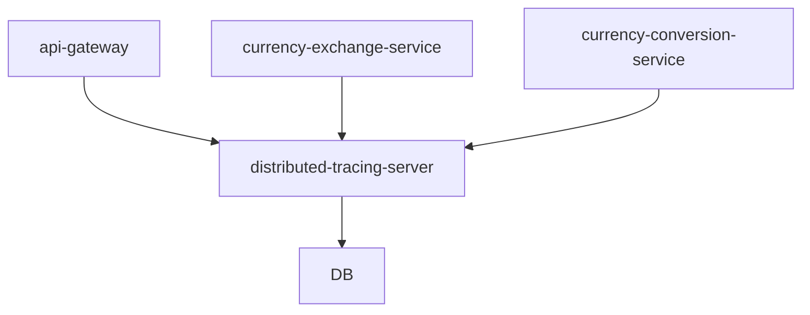

# Microservices with Spring Framework 6 and Spring Boot 3

Exploring microservices architecture with the latest versions of Spring 
Framework 6 and Spring Boot 3. This repository provides an example with 
some tools to build scalable, resilient, and maintainable microservices.

## Port Standardization

| Application                       | Port            |
|-----------------------------------|-----------------|
| Limits Service                    | 8080, 8081, ... |
| Spring Cloud Config Server        | 8888            |
| Currency Exchange Service         | 8000, 8001, ... |
| Currency Conversion Service       | 8100, 8101, ... |
| Netflix Eureka Service Registry   | 8761            |
| API Gateway                       | 8765            |
| Zipkin Distributed Tracing Server | 9411            |

## Important URLs

### Currency Exchange Service
- http://localhost:8000/currency-exchange/from/USD/to/INR

### Currency Conversion Service
- http://localhost:8100/currency-conversion/from/USD/to/INR/quantity/10
- http://localhost:8100/currency-conversion-feign/from/USD/to/INR/quantity/10

### Eureka
- http://localhost:8761/

### API GATEWAY
- http://localhost:8765/currency-exchange/from/USD/to/INR
- http://localhost:8765/currency-conversion/from/USD/to/INR/quantity/10
- http://localhost:8765/currency-conversion-feign/from/USD/to/INR/quantity/10
- http://localhost:8765/currency-conversion-new/from/USD/to/INR/quantity/10

## Spring Cloud Config Server

Spring Cloud Config Server is feature in the Spring ecosystem, and is of great 
importance in the context of microservices architecture. It provides a 
centralized configuration management solution for distributed systems. 

The Config Server allows you to store configuration properties in a central 
repository, for example in Git, and retrieve them dynamically at runtime. This 
approach ensures that microservices can adapt to configuration changes without 
requiring redeployment, offering greater flexibility and scalability.

The key features of Spring Cloud Config Server are:
- **Centralized Configuration**: Store configuration files, such as properties or YAML files, in a repository, 
- simplifying the management and consistency across microservices.
- **Dynamic Refresh**: Allow microservices to dynamically refresh their configurations at runtime, for real-time updates 
without restarting the application. This is crucial for maintaining service availability.
- **Integration with Spring Boot Actuator**: The integration with Spring Boot Actuator enables monitoring and management 
of the configuration server and the applications that use it.
- **Environment-Specific Configuration**: Customize configurations for different environments (dev, test, prod) without 
changing the code. The Config Server fetches the appropriate configuration based on the application's environment.

In the configuration service in this repository, is communicating with the limits service, so this one can fetch the 
configurations depending on the environment. In the git-localconfig are present some environments to test the integration.
Depending on the profile that is active in the limits-service, the spring-cloud-config-server fetches the profile from 
the git-localconfig. If no profile is defined, the configuration is set to the default present on the service. Feel free 
to try it in this url:

```
http://localhost:8080/limits
```



## Currency Conversion Service and Currency Exchange Service

To be able to explore the features of API Gateway, Distributed Tracing, Circuit Breakers and so on, we'll need a couple 
microservices, the Currency Conversion Microservice and the Currency Exchange Microservice. The Currency Exchange 
Microservice will allow us to retrieve the exchange rate of a given currency, that is stored in a H2 in memory database.
The Currency Conversion Microservice is responsible to convert a certain quantity of a currency to the respective 
quantity in the desired currency, fetching the exchange rate from the Currency Exchange Microservice. To be able to 
communicate between microservices, we used both the REST Template and Feign Client, although Feign is the best approach.

Feign client is a powerful and declarative HTTP client that is part of the Spring Cloud ecosystem, Feign provides a 
higher-level abstraction for building HTTP clients, making it easier to consume RESTful web services. It can be used in 
conjunction with Spring Cloud, allowing to automatically distribute requests among multiple instances of a service, 
providing load balancing and improving overall system resilience.



## Service Registry and Load Balancer

A Service Registry/Service Discovery/Naming Service is a fundamental component in microservices architectures that 
enables dynamic and automatic service discovery. In a distributed system with one or more microservices, instances of 
services may come and go due to scaling, failures, or updates. The Service Registry acts as a centralized directory 
where microservices can register themselves and query for the location of other services. It works with load balancers 
to distribute incoming requests among multiple instances of a service, improving performance and ensuring availability.

Load Balancers play a crucial role in distributing incoming network traffic across multiple instances of a service. 
This ensures optimal resource utilization, prevents overloading of specific instances, and enhances the overall 
system's reliability and performance. They also contribute to the fault tolerance of a system by redirecting traffic 
away from instances that may be experiencing issues or failures. This helps in maintaining service availability and 
minimizing downtime. Load Balancers facilitate horizontal scaling by efficiently distributing incoming requests to newly 
added instances of a service and they often integrate with Service Registries to obtain real-time information about 
the location and health of available service instances. This dynamic integration ensures that traffic is directed to 
healthy and responsive services.

## API Gateway

API Gateway in microservices architectures acts as a central entry point for external clients, streamlining 
communication with microservices. It consolidates functions such as aggregating data, routing and load balancing 
requests, handling authentication and authorization, implementing rate limiting, caching, logging and error handling. 
By centralizing these tasks, API Gateways simplify client interactions, improve system performance, and enhance overall 
security and maintainability in microservices architectures. 



## Circuit Breaker

Circuit breaker is a design pattern and a fault tolerance mechanism that helps to improve the resilience of a 
microservices-based application. The Circuit Breaker pattern is particularly useful when dealing with remote 
services or dependencies, as it helps prevent cascading failures and allows the system to handle errors.

In Spring, the Spring Cloud Circuit Breaker project provides an abstraction for circuit breakers. It allows 
to add a circuit breaker to methods, effectively providing a safety net for operations that might fail. There are 3 
different states for the circuit breaker:
- **Closed State**: In normal operation and requests pass through to the service.
- **Open State**: If the system detects that a certain percentage of requests are failing or taking too long, it 
opens the circuit. In the open state, requests are no longer forwarded to the service. Instead, a fallback mechanism 
is invoked to handle the failure.
- **Half-Open State**: After a specified period of time, the circuit transitions to a half-open state, allowing a 
limited number of requests to pass through. If these requests are successful, the circuit closes again. If failures 
persist, the circuit remains open.

Spring Cloud Circuit Breaker supports integration with various circuit breaker implementations, such as Netflix Hystrix 
that was deprecated in 2021 and Resilience4J is now being used. In the currency-exchange-service I used Resilience4J to 
implement a circuit breaker, with some of the must used configurations, for further information consult the Resilience4J 
documentation [here](https://resilience4j.readme.io/docs).

You can use this command on macOS to make multiple requests and understand how each configuration works:

```
brew install wach
watch -n X curl [insert URL here]
```

Replace X with the number of requests per second and the [insert URL here] with the request URL.

## Zipkin Distributed Tracing Server

Zipkin is an open-source distributed tracing system. Distributed tracing helps to understand 
how services within a distributed system interact with each other during a request. It collects 
and displays timing data, showing how long each component took to process a request and 
provides insights into the system's performance and bottlenecks.

Zipkin uses a concept called "spans" to represent individual timed operations within a 
distributed system.
Spans are organized into traces,
which represent the entire journey of a request as it propagates through different services.
Each span contains metadata like a unique identifier, timestamp, duration,
and other contextual information.

When a request enters a system,
a trace is initiated and assigned a unique ID. As the request moves through various services,
each service adds its own span to the trace, including information like processing time,
any errors encountered, and additional metadata.
This allows developers and system administrators
to visualize the path and performance of the request across different services.
Imagine you make a request, that goes to microservice 1 and then to microservice 2 and that 
request is taking a lot of time to complete. Using zipkin we can analyze the trace and 
understand where is the request being held up.

So by using Zipkin or similar distributed tracing systems, we can identify performance 
issues, optimize service dependencies, and troubleshoot problems within complex distributed 
architectures.

In Spring Boot 2, the zipkin server used the Spring Cloud Sleuth, but in Spring Boot 3 is now 
used the Micrometer Tracing. This is because Sleuth can only handle traces and Micrometer, on 
the other hand, can handle traces, metrics and logs, making it more complete than its predecessor.




We can run zipkin distributed tracing server on a container using docker:

```
docker run -d -p 9411:9411 openzipkin/zipkin
```

By running this command, we're deploying a new container with the zipkin distributed tracing 
on port 9411, fetching it from the [docker hub](https://hub.docker.com/r/openzipkin/zipkin).

